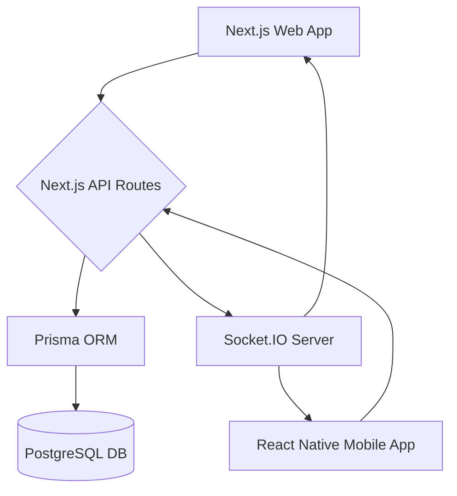

Visualize the system architecture with this Mermaid diagram. It shows the flow of data from the Next.js Web App and React Native Mobile App through the Next.js API layer to the PostgreSQL database, and the real-time communication via Socket.IO. 

